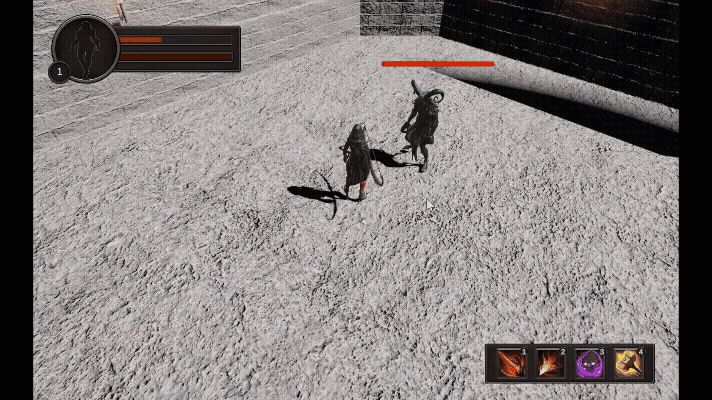
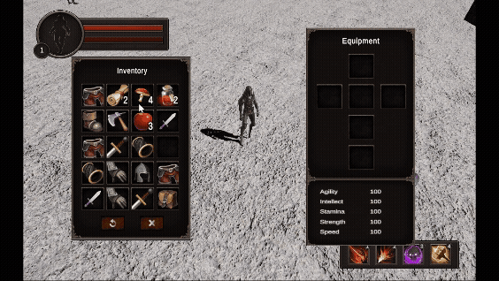
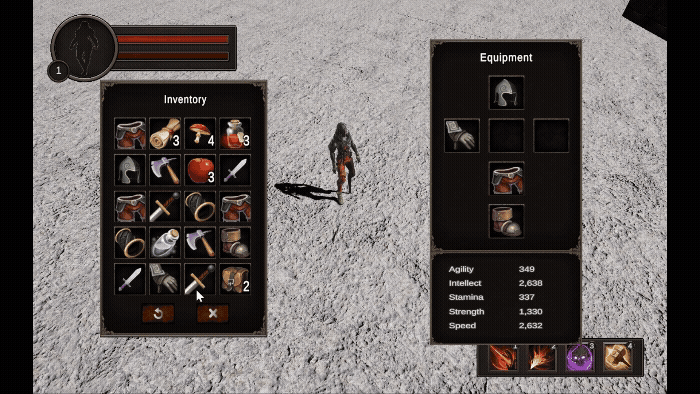

<h1 align="center">Undervein(Unity3D, 개인 프로젝트)</h1>

   (해당 배너 이미지는 AI로 생성되었습니다)

---
## 프로젝트 소개
**Undervein**은 Unity6 기반으로 제작한 3인칭 Top-Down RPG 프로젝트입니다. Undervein 은 “땅속 깊은 곳(Under)” + “혈관/맥(Vein)”의 의미를 담고 있으며,
어두운 지하 던전 속을 탐험하고 몬스터와 전투를 벌이는 세계관을 상징적으로 담아내며 표현했습니다.

## 제작기간
**약 1.5개월 (2025/07/17 ~ 2025/08/20)**

## 리소스
**Turbosquid, Mixamo, Unity Asset Store** 등에서 제공하는 무료 에셋과 모델을 활용하여 개발되었습니다

---
## 주요 특징
- **탑다운 3D 컨트롤**: 플레이어 이동 및 마우스 클릭 기반 목표 지정
- **AI 및 전투 시스템**: NavMesh 기반 적 추적, 거리 기반 공격, 애니메이션 상태 관리
- **아이템/인벤토리 시스템**: 장비, 소비 아이템 사용, 아이템 픽업
- **이펙트 및 파티클 시스템**: GPU 기반 파티클, 스킬 효과 구현
- **커스터마이징 가능한 애니메이션**: Idle, Move, Attack, Hit 등 상태 전환 처리

---
## Firebase기반 로그인 시스템

   

- Firebase Authentication을 기반으로 회원가입 / 로그인 / 로그아웃 기능을 구현했습니다.
- Email & Password 방식의 인증 시스템을 사용했으며, FirebaseAuth의 비동기 API(CreateUserWithEmailAndPasswordAsync, SignInWithEmailAndPasswordAsync)를 활용했습니다.
- Firebase에서 제공하는 상태 변경 이벤트(StateChanged)를 통해 로그인 상태가 바뀌면 UI에 자동으로 반영되도록 구조화했습니다.

---
## Characters

   

- Unity Character Controller와 NavMeshAgent을 활용하였습니다.
- 3인칭 Top-Down Camera 시점으로 구현하여 유저가 바닥을 클릭하면 같은 연출을 했습니다.
- Mouse Raycast 기반 Reticle 표시 기능 또한 추가하여 직관적인 조작감을 추가했습니다.

## FSM(Finite State Machine) 
- 플레이어와 몬스터 모두 FSM (Finite State Machine)구조로 구현하였습니다. 
- 몬스터 AI는 Waypoint를 따라 순찰하며, 시야 범위 내에 플레이어가 감지되면 추적 및 전투 상태로 전환할 수 있습니다.
- FSM 상태 : IdleState / MoveState / AttackState / DeadState

## 전투 시스템

- 플레이어와 몬스터의 공격 FSM을 구현하였으며, 피격/사망 처리와 함께 공격 이펙트를 연동하여 전투의 타격감을 강화했습니다.

   

---
## Inventory/Equipment

   

- 장비 아이템(Equipment)은 인벤토리에서 장착할 수 있으며, 무기(일반Mesh) 및 방어구(Skinned Mesh)를 캐릭터에 교체 적용할 수 있습니다. 

## Equip Skinned Mesh

   

- 무료 Asset의 한계를 보완하기 위해 Blender에서 Skinned Mesh 모델을 직접 제작하여 게임 내에 적용했습니다.
- 플레이어 모델에서 Armature(Bone)을 유지하고, 신발, 갑옷, 장갑 등의 부분별 Skinned Mesh모델을 Blender에서 직접 제작했습니다. 
- 각 파트는 쨍한 초록/주황 계열의 재질(Material)로 구분하여 시각적 효과를 강조했습니다. 

## Equip Separate Model Mesh

   

- 플레이어 기본 모델의 Armature를 재활용하여, 무기 Mesh들을 Unity Armature(Bone)에 수작업으로 연결했습니다.
- 이 과정을 통해 애니메이션 동작 시 PartObject가 자연스럽게 움직이도록 구현하였으며, Player Mesh를 제외한 Armature와 무기/장비 파츠만을 Prefab으로 제작하여 장비 교체 시스템을 표현했습니다.

---
## Loot & Consume Items

  

- 바닥에 떨어진 아이템과 충돌 시 자동으로 아이템 습득 후 인벤토리에 추가됩니다.

  

- Consumable Item (예: HP Potion, Mushroom 등)은 인벤토리에서 우클릭 사용 시 체력을 회복하는 등 지정된 Stats을 증가시킬 수 있습니다.

  

---
## NPC Dialogue System

   

   (해당 다이얼로그 내용은 AI로 생성되었습니다)

- 특정 NPC를 우클릭으로 Targeting 후, 플레이어가 지정된 거리까지 이동하면 대화가 시작됩니다.
- NPC와의 대화 시 대화창 UI가 열리고 애니메이션이 연동되어 자연스러운 연출을 구현했습니다.

---
## 개발 환경
- Engine: Unity 6
- Language: C#
- IDE: Visual Studio
- 3D Modeling: Blender (Custom Skinned Mesh 제작, 파츠 모델링)

